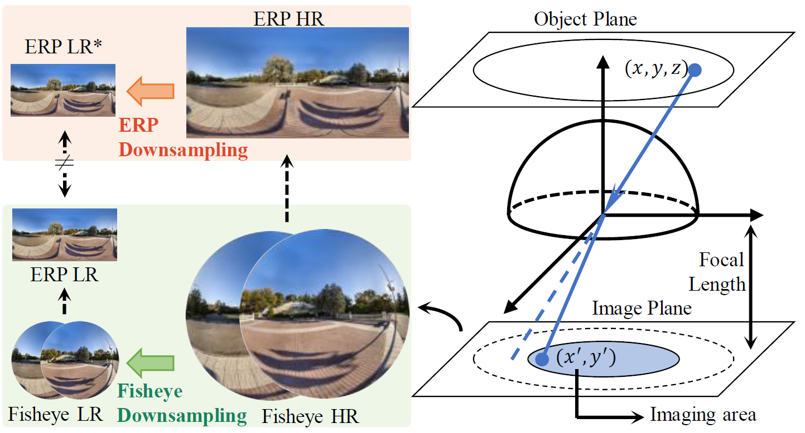
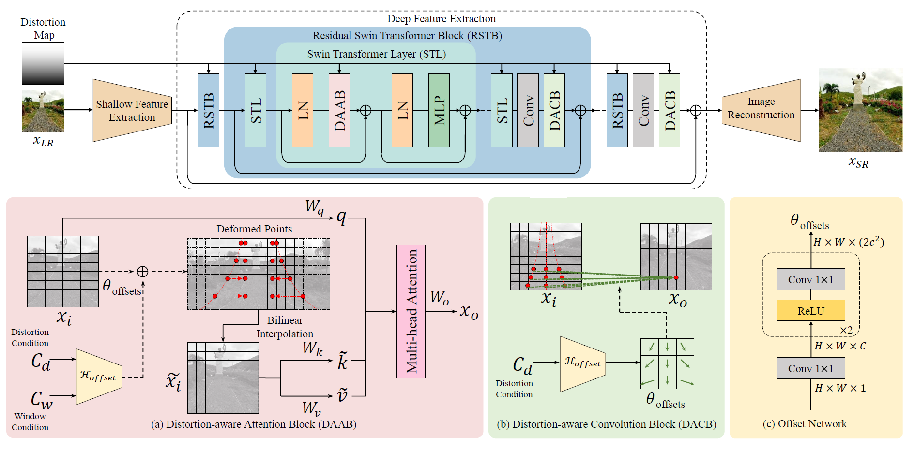
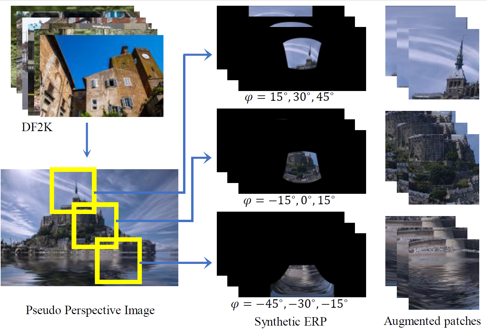

# (CVPR2023) OSRT: Omnidirectional Image Super-Resolution with Distortion-aware Transformer [[PDF](https://arxiv.org/abs/2302.03453)]

Fanghua Yu, [Xintao Wang](https://xinntao.github.io/), Mingdeng Cao, Gen Li, [Ying Shan](https://scholar.google.com/citations?user=4oXBp9UAAAAJ&hl=en), [Chao Dong](https://scholar.google.com.hk/citations?user=OSDCB0UAAAAJ&hl=zh-CN)

>[XPixel Group](http://xpixel.group/)\
>Shenzhen Institutes of Advanced Technology, Chinese Academy of Sciences\
>Applied Research Center (ARC), Tencent PCG\
>The University of Tokyo\
>Platform Technologies, Tencent Online Video\
>Shanghai AI Lab

---

[//]: # (|                     Ground-Truth                     |                      Bicubic                      |    [RCAN]&#40;https://github.com/yulunzhang/RCAN&#41;     |   [SRResNet]&#40;https://github.com/xinntao/ESRGAN&#41;    |)

[//]: # (|:----------------------------------------------------:|:-------------------------------------------------:|:-------------------------------------------------:|:--------------------------------------------------:|)

[//]: # (|         |  |     |  |)

[//]: # (| [EDSR]&#40;https://github.com/sanghyun-son/EDSR-PyTorch&#41; | [SwinIR]&#40;https://github.com/JingyunLiang/SwinIR&#41;  |                    SwinIR-AUG                     |                  OSRT-AUG &#40;ours&#41;                   |)

[//]: # (|       |  |  |      |)


|               Ground-Truth (X4)               | [EDSR](https://github.com/sanghyun-son/EDSR-PyTorch) | [SwinIR](https://github.com/JingyunLiang/SwinIR)  |                    SwinIR-AUG                     |                OSRT-AUG (ours)                 |
|:---------------------------------------------:|:----------------------------------------------------:|:-------------------------------------------------:|:-------------------------------------------------:|:----------------------------------------------:|
|  |       |  |  |  |
|  |       |  |  |  |
|  |       |  |  |  |
|  |       |  |  |  |
|  |       |  |  |  |

---

## Introduction

### Fisheye Downsampling
> In practice, ODIs are acquired by the fisheye lens and stored in ERP. Given that the low-resolution issue in real-world scenarios is caused by insufficient sensor precision and density, the downsampling process should be applied to original-formatted images before converting into other storage types. Thus, to be conformed with real-world imaging processes, we propose to apply uniform bicubic downsampling on Fisheye images, which are the original format of ODIs. The new downsampling process (called Fisheye downsampling) applies uniform bicubic downsam-pling on Fisheye images before converting them to ERP im-ages. Our Fisheye downsampling is more conducive to ex-ploring the geometric property of ODIs.
<p align="center">
  
</p>

We provide implementation codes of Fisheye Downsampling as an independent downsampling kernel for ODIs:
```python
from PIL import Image
from torchvision import transforms
from odisr.utils.erp_downsample import erp_downsample_fisheye
given_path = ''
save_path = ''
scale = 4
erp_hr = transforms.ToTensor()(Image.open(given_path).convert('RGB'))
erp_lr = erp_downsample_fisheye(erp_hr, scale)
transforms.ToPILImage()(erp_lr).save(save_path)
```

### OSRT
> We propose the first Transformer for Omnidirectional image Super-Resolution (OSRT), and incorporate geometric prop-erties in a distortion-aware manner. Specifically, to mod-ulate distorted feature maps, we implement feature-level warping, in which offsets are learned from latitude condi-tions. In OSRT, we introduce two dedicated blocks to adapt latitude-related distortion: distortion-aware attention block (DAAB), and distortion-aware convolution block (DACB). DAAB and DACB are designed to perform distortion mod-ulation in arbitrary Transformers and ConvNets. These two blocks can directly replace the multi-head self-attention block and convolution layer, respectively. The benefit of DAAB and DACB can be further improved when being in-serted into the same backbone network. OSRT outperforms previous methods by about 0.2dB on PSNR.
<p align="center">
  
</p>

### Pseudo ODI Augmentation
> The largest ODIs dataset contains only 1K images, which cannot provide enough diversity for training Transformers. Given that acquiring ODIs requires expensive equipment and tedious work, we propose to gen-erate distorted ERP samples from plain images for data aug-mentation. In practice, we regard a plain image as a sampled perspective, and project it back to the ERP format.
<p align="center">
  
</p>

---

[//]: # (## Contents)

[//]: # (1. [Environment]&#40;#Environment&#41;)

[//]: # (1. [Data Preparation]&#40;#Data Preparation&#41;)

[//]: # (1. [Training]&#40;#Training&#41;)

[//]: # (1. [Testing]&#40;#Testing&#41;)

[//]: # (1. [Citation]&#40;#Citation&#41;)

[//]: # (1. [License and Acknowledgement]&#40;#License and Acknowledgement&#41;)

## Environment
- [PyTorch >= 1.7](https://pytorch.org/)
- [BasicSR](https://github.com/XPixelGroup/BasicSR/blob/master/INSTALL.md) 
#### Installation
```
pip install -r requirements.txt
```

## Data Preparation
1. Download lau dataset [here](https://drive.google.com/drive/folders/1w7m1r-yCbbZ7_xMGzb6IBplPe4c89rH9?usp=sharing).
```bash
mkdir datasets
ln -s YOUR_LAU_DATASET_PATH datasets/lau_dataset
```
2. Clean dataset.
```bash
python odisr/utils/make_clean_lau_dataset.py
```
3. Crop training patches
```bash
python odisr/utils/extract_subimage.py
```
4. Build DF2K-ODI augmentation dataset from DF2K ([DIV2K](https://data.vision.ee.ethz.ch/cvl/DIV2K/)/ [Flickr2K](https://github.com/LimBee/NTIRE2017))
```bash
ln -s YOUR_DIV2K_TRAINSET_PATH datasets/DIV2K_train_HR
ln -s YOUR_FLICKR2K_TRAINSET_PATH datasets/Flickr2K_HR
python odisr/utils/make_augmentation_dataset.py
```
As DF2K-ODI is already consisted of image patches, cropping patches for lau datasets is __NECESSARY__ when training with this dataset.
Maximum `gt_size` for DF2K-ODI is 256.

## Training
We provide training options of OSRT-full (10M) and OSRT-light(1M) on X2, X4, X8 and X16 SR.

All comparison models on X4 SR is available.

Training OSRT-full and SwinIR:
```bash
CUDA_VISIBLE_DEVICES=0,1,2,3,4,5,6,7 python -m torch.distributed.launch --nproc_per_node=8 --master_port=7777 train.py -opt ./options/train/*.yml --launcher pytorch
```

Training OSRT-light and other baseline models:
```bash
CUDA_VISIBLE_DEVICES=0,1,2,3 python -m torch.distributed.launch --nproc_per_node=4 --master_port=7777 train.py -opt ./options/train/*.yml --launcher pytorch
```

## Testing
Pretrained models can be downloaded [here](https://drive.google.com/file/d/133XMP2vgpwMrthxtgT1QfUzChfI__7au/view?usp=sharing).

Testing OSRT-full and OSRT-light:
```bash
ln -s YOUR_PRETRAIN_MODEL_PATH pretrained_models
CUDA_VISIBLE_DEVICES=0 python test.py -opt ./options/test/*.yml
```

---
## Citation
```
@article{yu2023osrt,
  title={OSRT: Omnidirectional Image Super-Resolution with Distortion-aware Transformer},
  author={Yu, Fanghua and Wang, Xintao and Cao, Mingdeng and Li, Gen and Shan, Ying and Dong, Chao},
  journal={arXiv preprint arXiv:2302.03453},
  year={2023}
}
```

## License and Acknowledgement
This project is released under the MIT license. The codes are heavily based on [BasicSR](https://github.com/XPixelGroup/BasicSR). Please also follow their licenses. Thanks for their awesome works.
